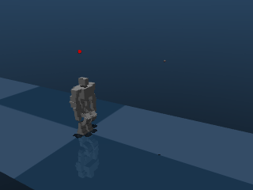

# SIP2HumnWalking


PD controller for walking of 22-DOF Humanoid Robot Using Spherical Inverted Pendulum in MuJoCo physics engine

## Python Packages 
The Following packages are required to run the ```SIPlib``` library:

```mujoco, numpy, scipy, matplotlib```

## Run ```runKondo-SIP.py```

## SIP Based Walking
In the simulation, spherical inverted pendulum (SIP) model is used in the single support phase and suspended pendulum is used in the double support phase of walking.

## LIPM Based Walking
To run linear inverted pendulum model (LIPM) based walking simulation, change ```SIPwalk=False``` in ```runKondo-SIP.py```

## Citation
If you use SIP based walking for published research, please cite:

```
@article{gora2025gait,
  title={Gait Generation of a 10-Degree-of-Freedom Humanoid Robot on Deformable Terrain Based on Spherical Inverted Pendulum Model},
  author={Gora, Sunil and Gupta, Shakti S and Dutta, Ashish},
  journal={ASME Journal of Mechanisms and Robotics},
  volume={17},
  number={2},
  year={2025},
  publisher={American Society of Mechanical Engineers Digital Collection}
}
```
